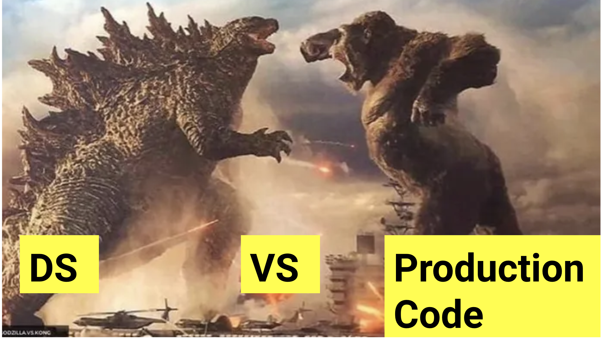

# Some Best Practices for Big Data DE/DS (from the trenches)

Some tips and tricks coming from the trenches.

If you are in a team mostly working on *Notebooks* and you and your team are looking for better ways to work. Please keep reading :)  

If you are in a team with *end-to-end CI/CD using IDEs*, maybe you can skip most of this document. 




## About   

I am Dr Guillermo. G Schiava D'Albano, currrently I am a Sr Partner SA covering Scandivania, Benelux, UK and IR.

For general tips and information on Big Data and Data Science follow me on LinkedIn https://www.linkedin.com/in/g-schiava/ 

If you want to collaborate please contact me, do a pull request :)   

## Introduction

Ideally production code should be done on an IDE running local tests, then should be committed to Git then the usual peer-review -> Merge, CI/CD...

The reality for the majority of the teams (DE/DS) coming to big data is quite different. 
* most of the DE/DS are not used to write unit test, not they see the need for them to exist. 
* most of the code is developed on Notebooks some times on all the data.

The first part of this document is DS specific while the second part is DE/DS

## If you are in a hurry to do CI/CD

I would recommend you to read all of this document but below you have few highlighs 

* Notebooks: jump to [this](https://github.com/ggschiava/bestpractices/blob/main/BestPracticesDSDE.md#uning-databricks-notebooks) section 
* IDEs: jump to [this](https://github.com/ggschiava/bestpractices/blob/main/BestPracticesDSDE.md#using-databricks-and-ides) section

## Data Science specific (the good old Notebook) 

Of of course exploration happens on a *‘dirty’* notebooks.  Noone in their right mind would expect you to explore on an IDE :-p.      
This does not mean you need to  *explore*/*run* your ML on all the data first.  This is a common mistake even on DE teams creating ETL jobs...   

Explore on an extract of all the data, create a model that is working on a small scale. Then run it on 25%, 50%, 75% of the data then on 100%.    
In this way you are splitting the development and the debugging in two different steps   
1. your business logic and model works    
1. big data issues such as skew data overloading of nodes etc.    

If you do it all together you can not be sure what went south with your app. I.e. is the 
model crashing because there is Data Skew or is because the incorrect data is being loaded.   

I have been in a big international bank where a single DS brought down the bank's cluster  running a random forest for 2 days.  Just because you have the power to spin up a big-cluster on the cloud, this does not mean you should do it all the time.  Develop on a single node cluster or with 2 nodes max. 
   
When you are happy i.e. the notebook works, start to extract functions i.e. we develop dirty on big chunks of code. Extracting is splitting big chunks of code into meaningful functions with meaningful names.  
Add unit test to each function, please note unit test should not use I/O, more on this in the following section.   
I.e. if you are writing PySpark just create a Dataframe with the kind of data your function will use 

```python
df = spark.createDataFrame(
    [(1, 1.0), (1, 2.0), (2, 3.0), (2, 5.0), (2, 10.0)],
    ("id", "v"))
```
   
The notebook you are writing (and has decided to go into production) would be read in the near future by someone else that would need to make changes to adapt your code.  
Think of that poor person trying to make sense of the code    and who most probably  would be you . Testing is a way to add documentation that does not lie.  
If you have the skills/time this should be moved to an IDE. If you keep it on notebooks if fine but  please add unit tests to your notebooks and even if a DS project uses the best practices developed in the last 30 years :) 

#### Uning Databricks Notebooks

If you are coding on PySpark I would recommend you to use Nutter for your unit test of Notebooks. 

* [Best practicies for Databricks Notebooks](https://docs.databricks.com/notebooks/best-practices.html) there are some software engineering best practices for notebooks. Personally I preffer nutter for unit test. 
* [Adifferent option using nutter library](https://github.com/alexott/databricks-nutter-repos-demo)(kudos to Alex Ott for creating this repo) there is an example on Azure but that will run for AWS and GCP on how to do unit test using PySpark. The only caveat is the use of delta table when reading for unit test. Personally I would suggest to keep all your functions ingesting a *df* and returning a *df*. That would simplify how to do business logic testing
 ```python
df = filter_current_customers(df)
```

 ## Data Science and Data Engineering (from the ideal scenario to the reality)

### Ideally use case 

IDE (PyCharm, Intellij, etc)  with unit tests running locally using Open Source Spark (OOS) the APIs are the same with Databricks.  
There is no need to develop on a running cluster. Extract a sample of the data you will be working on. Create your own Dataframes and use these to develop, see previous code snippet. 


There is no need to use DBconnect to develop on a running cluster.  
This local develop code should be committed to Git (peer review etc) where all the CI/CD process will start and where Integration Test would run.   

Of course from a local solution to a solution that runs at scale on all the data there is a gap.  
As there may be the need to further improvements on data partitions, Z ordering, file compaction, etc.   https://docs.databricks.com/delta/optimizations/index.html 
But this should not mean forgetting the best software practices. 

When you develop you code :
1. first solve the business logic 
1. then you solve any 'scale' issues 


#### Using Databricks and IDEs
This is an area that Databricks is continuing investing in. [Here](https://docs.databricks.com/dev-tools/ide-how-to.html) are ways for you to work today on IDEs today in Databricks. In particular you could use [dbx](https://docs.databricks.com/dev-tools/ide-how-to.html#run-with-dbx) to make your local code run on a DB cluster. You can read more about dbx [here](https://docs.databricks.com/dev-tools/dbx.html) 


### Let's be realistic :-) we know it's 'easy' to use notebooks so...

It is not simple to set up local development environments. And to have a full CI/CD pipeline. Maybe the team is not yet there. Keep developing on notebooks... for now. 

You and your team are most probably developing and running notebooks on production.

Still there are some things you and your team can do to improve the quality of your work.  
And how you do development : 

* develop using a single node cluster. This will force you not develop on all the data. 
* to develop and test your business logic you do not need to run it on all the data (previous point) either extract some data from the DB you need to work with or mock them creating your own Dataframes (see previous code snippet)   
* when the solution works, you will end up with a series of code-blobs/functions. -> extract to extract functions and on a second second Notebook that calls the one where you develop a  run test for your code. 

This is not ideal but at least will give you some level of security that the code comply with all the business rules. In an ideal scenario you should have a test for each of the business requirements 


## Some tips for writing functions 
* Functions should only do one thing i.e. if a function reads and transform is doing two things
* functions should be up to 4/6 lines max. Basically when you can not extract any more from a function you are fine   https://www.jetbrains.com/help/idea/extract-method.html 

* unit test should not use I/O. Create Dataframes programmatically. Regardless if this is developing locally or in a Notebook. Unit tests should be fast, without I/O why? Because they should only test Business Logic and only fail if the Business logic is wrong not because someone updated a Table or the table does not exist.

* write unit test 

* write unit test 

* write unit test (yes you should really do it ...    )

* write code not for the computer to understand but for your peers to understand. 

* comment only when it's needed i.e. the best comment is a small function with a meaningful name that has a test. Test do not lie, comments are hardly  ever maintained and could mislead 

## Data Science MLOps 

* Great repo with MLOps example easy to follow by RafiKurlansik [dais2021_full_ml_lifecycle](https://github.com/RafiKurlansik/dais2021_full_ml_lifecycle) Just updated Koalas for Spark Pandas API
* Full DS and MLOps using IDEs Video [MLOps on Databricks: A How-To Guide](https://www.youtube.com/watch?v=JApPzAnbfPI) and the free E-book : [A new data-centric approach to building robust MLOps practices](https://www.databricks.com/p/ebook/the-big-book-of-mlops)
* Experimental : [MLflow Pipelines (experimental)](https://www.mlflow.org/docs/latest/pipelines.html), also the DAIS presentation [MLflow Pipelines: Accelerating MLOps from Development to Production](https://www.youtube.com/watch?v=0wT-EJBw2n4) and the blog [Introducing MLflow Pipelines with MLflow 2.0](https://www.databricks.com/blog/2022/06/29/introducing-mlflow-pipelines-with-mlflow-2-0.html)


## Data Engineering Loading data into the Lakehouse

There are more than few ways to load data into the Lakehouse:
*  [Ingest data into the Databricks Lakehouse](https://docs.databricks.com/ingestion/index.html) links to the different ways to load data 
*  [Ingesting from Kafka](https://docs.databricks.com/structured-streaming/kafka.html) 
*  ... and many more 

As a customer/partner of Databricks or as a Microsoft Employee you have access to the [Databricks Academy](https://www.databricks.com/learn/training/login) 

To understand better how to work on the Lakehouse I would suggest you do at least part of the Data Engineering Learning Plan. These courses have videos and code that you can follow along.

1. Go to [Databricks Academy](https://www.databricks.com/learn/training/login) , use your company email if you do not have yet a password click 'Forgot your password?'
2. Click course catalog   
  
3. Search for 'data engineering with Databricks' , Module 2 you have Delta   
  


### To have an overview of all the Data Engineering courses 
Search for 'Data Engineer ' and click on 'Data Engineer Learning Plan'   
 

Of course you could do the same for Data Science. 


## Some material that may help the team write better code


Martin Fowler Refactoring:  https://martinfowler.com/articles/refactoring-2nd-ed.html

Uncle Bob Clean architecture https://www.amazon.com/Clean-Architecture-Craftsmans-Software-Structure/dp/0134494164

Martin Fowler FlaccidScrum : https://martinfowler.com/bliki/FlaccidScrum.html

General software development: Uncle bob :
* Lesson 1 : https://www.youtube.com/watch?v=7EmboKQH8lM, 
* Lesson 2 : https://www.youtube.com/watch?v=2a_ytyt9sf8, 
* Lesson 3 : https://www.youtube.com/watch?v=Qjywrq2gM8o, 
* Lesson 4: https://www.youtube.com/watch?v=58jGpV2Cg50, 
* Lesson 5 : https://www.youtube.com/watch?v=sn0aFEMVTpA

The future of programming Uncle Bob https://www.youtube.com/watch?v=ecIWPzGEbFc

Don't put data science notebooks into production https://martinfowler.com/articles/productize-data-sci-notebooks.html


## Further on Big data   

Coursera   
* Data Science with Databricks for Data Analysts Specialization: https://www.coursera.org/specializations/data-science-with-databricks-for-data-analysts   

Spark Delta Lake  
* Making Apache Spark™ Better with Delta Lake :  https://www.youtube.com/watch?v=LJtShrQqYZY  
* Tech Talk: Top Tuning Tips for Spark 3.0 and Delta Lake on Databricks : https://www.youtube.com/watch?v=hcoMHnTcvmg   
* Advancing Spark - Delta Merging with Structured Streaming Data : https://www.youtube.com/watch?v=2Iy5S0Hf4XM&feature=youtu.be  
* Advancing Spark - Your Delta & Spark Q&A (SQLBits 2020 Part 1)  : https://www.youtube.com/watch?v=GAVXRP29-8c     
* Introducing MLflow for End-to-End Machine Learning on Databricks  : https://www.youtube.com/watch?v=nx3yFzx_nHI     


To improve how you design your pipelines    
* Functional Data Pipelines (this is before Delta so you may need to adapt this to your work) : https://medium.com/@maximebeauchemin/functional-data-engineering-a-modern-paradigm-for-batch-data-processing-2327ec32c42a    


Delta Lake Papers (optional if you want to go down the rabbit hole)     
* Delta Lake: https://databricks.com/wp-content/uploads/2020/08/p975-armbrust.pdf  
* Lakehouse http://cidrdb.org/cidr2021/papers/cidr2021_paper17.pdf  
  
